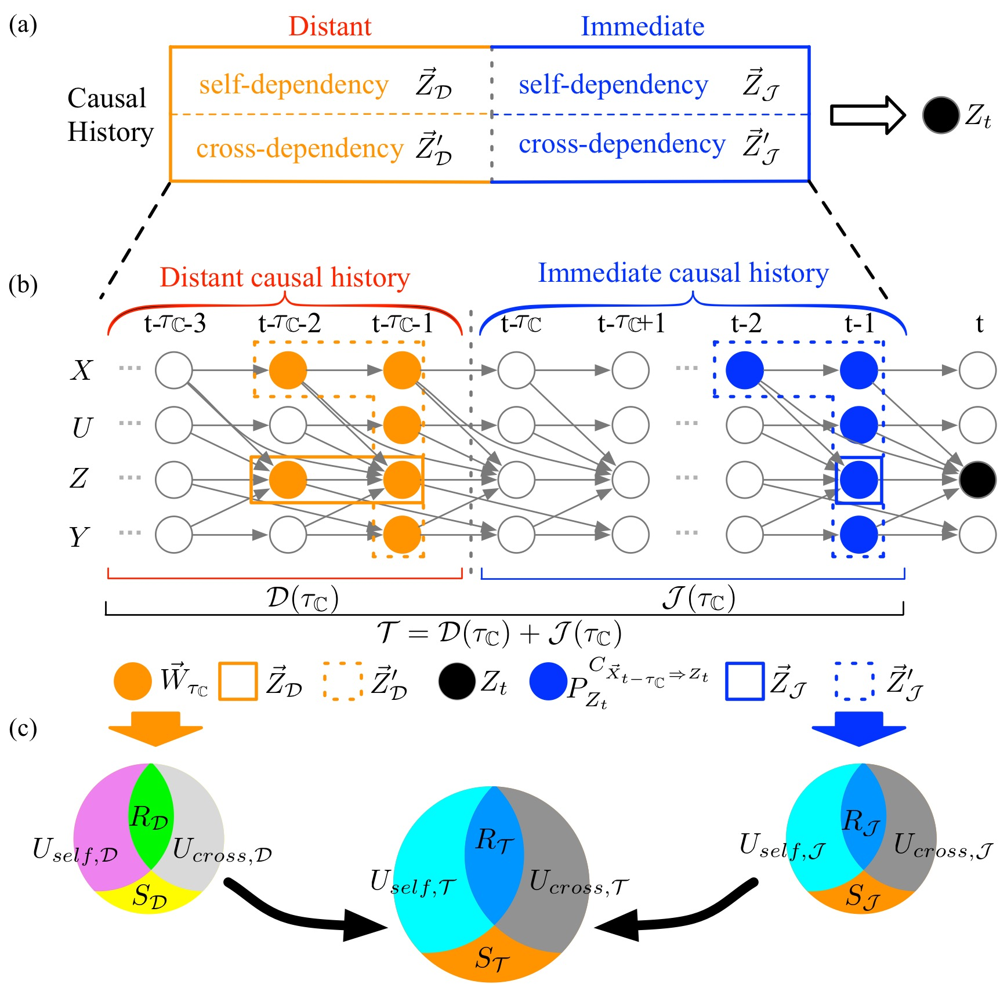

# An Information-Theoretic Framework for Causal History Analysis in Complex System Dynamics
===========================================================================================

## Introduction
This is an open-source program for evaluating the complex system dynamics by using a proposed causal history analysis framework.

<p align="center">

</p>

## References
- Jiang, P., & Kumar, P. (2019). Bundled interaction from causal history in complex system dynamics. In Review. [abbreviated as **BCHA**]
- Jiang, P., & Kumar, P. (2019). Using information flow for whole system understanding from component dynamics. In Review. [abbreviated as **CHA2**]
- Jiang, P., & Kumar, P. (2019). Information transfer from causal history in complex system dynamics. Physical Review E, 99(1), 012306. [abbreviated as **CHA1**]
- Jiang, P., & Kumar, P. (2018). Interactions of information transfer along separable causal paths. Physical Review E, 97(4), 042310. [abbreviated as **MPID**]

## Code Structure
```
|   README.md
|   environment.yml
|
|---info                         # the main code folder
|   |   core                     # the core python files
|   |   |   info.py              # the code for computing information measures
|   |   |   info_network.py      # the code for computing information measures in a DAG
|   |   models                   # several synthetic models
|   |   |   logistic.py          # the multivariate noisy logistic model
|   |   |   others.py            # other models
|   |   utils                    # utility functions used by codes in the core and models folders
|
|---examples                     # the example folders (including jupyter notebook for illustration)
|   |   trilogistic              # causal history analysis for the trivariate logistic model
|   |   quadlogistic             # causal history analysis for the quadvariate logistic model
|   |   OU                       # causal history analysis for Ornstein–Uhlenbeck process
|   |   Lorenz                   # causal history analysis for the Lorenz model
|   |   streamchemistry          # causal history analysis for an observed stream chemistry dynamics
|   |   bundled_streamchemistry  # bundled causal history analysis for an observed stream chemistry dynamics
```

## Requirements
1. Add the code folder `[causalhistory-folder]` into your environment variable `PYTHONPATH`.
2. Python package requirements:
- `scipy >= 1.2.1`
- `numpy >= 1.16.4`
- `networkx >= 2.2`
- `matplotlib >= 2.2.4`
- `pandas >= 0.24.2`
- `scikit-learn >= 0.20.3`
- `jupyter >= 1.0.0`
3. There are several options for computing information measures.
- K-Nearest Neighbor (KNN) method (see references: [Kraskov et al. 2004](https://journals.aps.org/pre/abstract/10.1103/PhysRevE.69.066138) and [Frenzel and Pompe 2007](https://journals.aps.org/prl/abstract/10.1103/PhysRevLett.99.204101)). There are two options for running KNN estimator. One relies on scipy's own KNN search module, which is **recommended** and used by the authors. The other employs an existing GPU package for conducting the KNN (not recommended because the authors do not notice much computation efficiency achieved, but users are free to play with it.).
    - Download the [Fast K-Nearest Neighbor search with GPU](https://github.com/PeishiJiang/knn_cuda) (Note that in Peishi's version the distance calculation is based on the maximum norm).
    - Specify `PYTHON_INCLUDE`, `PYTHON_LIB`, `CUDA_DIR` correctly in the `Makefile.config`.
    - Install [Boost](http://www.boost.org/) to enable the connection between C++ and Python code.
    - Type `make` to generate the `knn.so` dynamic library.
    - Copy `knn.so` to the utility folder by typing:
```
cp [knn-folder]/knn.so [causalhistory-folder]/info/utils/
```
- Kernel Density Estimation (KDE) method (see references: [Ruddell and Kumar 2009](https://agupubs.onlinelibrary.wiley.com/doi/full/10.1029/2008WR007279) and [Goodwell and Kumar 2017](https://agupubs.onlinelibrary.wiley.com/doi/full/10.1002/2016WR020216)). To generate the dynamic libraries for the Kernal Density Estimation (KDE) GPU by:
```
cd [causalhistory_folder]/info/utils/
make clean; make
```

## Examples
We provide the codes/notebooks for reproducing the five examples published in our papers (users are free to modify the parameters in the codes/notebooks). Notice that in the examples of trivaite logistic model, the OU process, and the Lorenz model, we assume the directed acyclic graph (DAG) for time-series of these systems follows the dynamical structure in their corresponding mathematical equation. However, for stream chemistry dynamics, we employ the [Tigramite](https://github.com/jakobrunge/tigramite_old) package to reconstruct the DAG based on time-series observations. For quadvariate logistic model example, instead of assuming the DAG according to the mathematical equations, we also employ the Tigramite to reconstruct the DAG before conducting the causal history analysis, with the aim of verifying the reliability of the Momentary Information for Weighted Transitive Reduction (MIWTR) in reducing the cardinality. Once the DAG for time-series is constructed, causal history analysis is conducted for each example by using the codes developed in this repository.

- Example 1: a trivariate logistic model in the papers **CHA1** and **CHA2** (causal history analysis, under the folder `[causalhistory-folder]/examples/trilogistic`)
  - Conduct the causal history analysis by running:
  ```
  python generate_cit_logistic.py
  ```
  - Visualize the results in the notebook `CHA_logistic.ipynb`.

- Example 2: the Ornstein–Uhlenbeck process in the paper **CHA1** (causal history analysis, under the folder `[causalhistory-folder]/examples/OU`)
  - Conduct the causal history analysis by running:
  ```
  python generate_cit_OU.py
  ```
  - Visualize the results in the notebook `CHA_OU.ipynb`.

- Example 3: the Lorenz63 model in the paper **CHA1** (causal history analysis, under the folder `[causalhistory-folder]/examples/Lorenz`)
  - Conduct the causal history analysis by running:
  ```
  python generate_cit_lorenz.py
  ```
  - Visualize the results in the notebook `CHA_Lorenz.ipynb`.

- Example 4: a quadvariate logistic model in the paper **CHA2** (causal history analysis with MIWTR, under the folder `[causalhistory-folder]/examples/quadlogistic`)
  - Reconstruct the DAGs for time-series with the data lengths ranging from 200 to 10000 by running the following shell script, which utilizes the python code `tigramite_analysis_logistic.py` for estimating each DAG. (Note that the Message Passing Interface (MPI) is required in the script to reduce the computation time, and one can specify the number of cores for use in the shell script.):
  ```
  ./logistic_loop.sh
  ```
  - Conduct the causal history analysis for each DAGs generated in the previous procedure and saved in `[causalhistory-folder]/examples/quadlogistic/networks` by running (Note that the MIWTR capability can be switched on/off by setting the parameter `transitive` in `generate_cit_quadlogistic.py`):
  ```
  python generate_cit_quadlogistic.py
  ```
  - Visualize the results in the notebook `CHA_quadlogistic.ipynb`.

- Example 5: an observed stream chemistry dynamics in the papers **CHA1** and **CHA2** (causal history analysis, under the folder `[causalhistory-folder]/examples/streamchemistry`)
  - Reconstruct the DAGs for time-series based on both the raw data and the flow rate-corrected data (both available at [Kirchner's 2013 PNAS paper](https://www.pnas.org/content/110/30/12213)) by using Tigramite package (Note that *the codes for estimating the DAG requires both Tigramite and MPI pacakges*):
  ```
  mpirun -n [number_of_codes] python generate_ts_graph_tigramite_[rawdata_or_correcteddata].py
  ```
  - Visualize and preprocess the network results in the notebook `network_preanalysis.ipynb` to generate a clean DAG by excluding any contemporaneous links generated by Tigramite
  - Conduct the causal history analysis for each DAGs generated in the previous procedure and saved in `[causalhistory-folder]/examples/streamchemistry/networks` by running (Note that the MIWTR capability can be switched on/off by setting the parameter `transitive` in `generate_cit_rawdata.py` and `generate_cit_correctedata.py`):
  ```
  python generate_cit_[rawdata_or_correcteddata].py
  ```
  - Visualize the CHA results in the notebook `CHA_stream_chemistry.ipynb`.

- Example 6: an observed stream chemistry dynamics in the paper **BCHA** (bundled causal history analysis, under the folder `[causalhistory-folder]/examples/bundled_streamchemistry`)
  - Compute bundled causal history analysis for the stream chemistry data under different K values in KNN estimator by running the following shell script:
  ```
  ./generate_bundled.sh
  ```
  - Generate the resulting plots by running the following python codes `show_CHA.py` and `show_CHA_varyingk.py`.

## License
This software is freeware and is released under restricted licences. See LICENSE.txt for more information.

## Contacts
Peishi Jiang (pjiang6@illinois.edu), Praveen Kumar (kumar1@illinois.edu)
